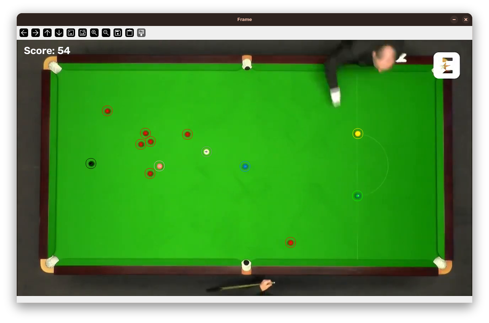

<div align="center">

# 🎱 Snooker Tracker

[](https://www.python.org/downloads/)
[](https://opencv.org/)
[](https://numpy.org/)

*A classic computer-vision pipeline that watches a fixed snooker video, tracks the cue ball and every coloured ball, and keeps score - no machine learning, just contours, moments and heuristics.*



</div>

---

## 🎯 The Task

Given a single, pre-recorded snooker video, the program must:

- Detect the white cue ball, all reds and the six colours in every frame
- Draw each ball's position and movement direction on the frame
- Detect when a shot ends (the table settles) and figure out which ball was potted
- Apply snooker scoring rules and keep a running score overlay

The whole pipeline relies on classical methods only - colour segmentation, contour analysis and centroid tracking - with hand-picked thresholds tuned to this exact video.

---

## 🔍 How It Works

### 1. 🎨 Ball Detection

Each ball is isolated with a colour-separation mask (`utils.ball_separator`). Binary masks are then analysed with `cv2.findContours`, and contours whose area falls inside a per-ball range are accepted. Ball centres come from image moments (centroid of the contour), filtered to lie within the hard-coded table bounds. Every colour has its own `min_area` because some balls are easier to segment than others in this footage.

### 2. 📍 Tracking & Movement

The cue ball's white centre is tracked across frames: the detected centre closest to the previous position becomes the current one, and a simple displacement velocity vector is drawn from it. If the vector length exceeds a movement threshold, the cue ball is considered moving. 

### 3. 🧠 Shot Logic & Scoring

The tracker follows a simple state machine:

- **Movement detected** → a shot is in progress, scoring is armed
- **Table still for 50 consecutive frames** → the shot is finished
- On finish, compare the state before and after the shot:
  - fewer **reds** than before → a red was potted (1 point)
  - otherwise, the first **missing colour** in a fixed check order gives the potted ball (yellow 2, green 3, brown 4, blue 5, pink 6, black 7)
- Once no reds remain, colours are retired one by one in the official sequence (`yellow → green → brown → blue → pink → black`) as they get potted

The current score is rendered live on every frame.

---

## 🏃 How to Run

Install the dependencies:

```bash
pip install opencv-python numpy
```

Place the video as `video.mp4` in the repository root (or pass any path):

```bash
python main.py                 # uses video.mp4
python main.py my_snooker.mp4  # or a custom video
```

A window opens with the annotated frames - ball circles, movement lines and the live score. Press `q` to quit.

The console mirrors the shot events:

```
Red ball potted
Move finished
Current score: 12
```

---

## ⚙️ Requirements

- Python 3.11+
- `opencv-python`
- `numpy`

---

## ⚠️ Limitations

- **Tuned to one video.** Table bounds, colour thresholds, ball areas and the settle-frame count are hard-coded for the target footage - on any other video the calibration constants would need adjusting.
- **Classical CV only.** Robustness comes from constraints: a static camera, fixed framing and predictable colours. Occlusions, shadows or a moving camera would break the segmentation.
- **Simplified snooker rules.** Fouls, respotted colours and free balls are not modelled.
